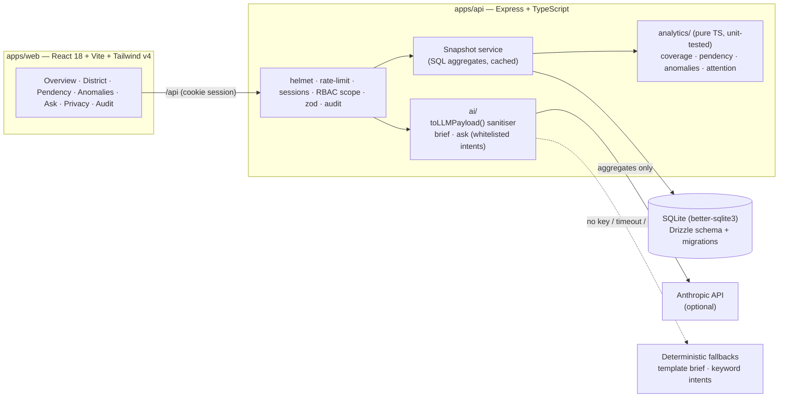

# SevaLens — Welfare Coverage Intelligence for Manipur

> **AI4SEVA · National Innovation Challenge on AI & Digital Governance – Manipur**
> Problem **SW-04** — AI-Based Welfare Service Gap & Coverage Analysis (Social Welfare Department, Govt. of Manipur)

SevaLens helps state and district welfare officers answer four questions every week:

1. **Where are eligible people not being reached?** Coverage gaps by district, block and scheme.
2. **Where are applications piling up?** Open cases, ageing, SLA breaches, and the stage where they're stuck.
3. **What looks wrong?** Explainable anomaly detection: duplicates, payments after death, spikes, officer outliers.
4. **Where should we act first?** A transparent 0–100 **Attention Score** per district and block, with a factor breakdown and an AI-drafted officer brief.

> ⚠️ **All beneficiary, application and payment data is synthetic** (fixed seed). District populations are approximate Census-2011-based estimates. The UI shows a persistent "Synthetic demo data" badge.

---

## Quick start

```bash
npm run setup   # install deps + run migrations + seed synthetic data (~3 s seed)
npm run dev     # API http://localhost:4000 + web http://localhost:5173
npm test        # vitest: analytics engine + PII sanitiser (26 tests)
```

Open **http://localhost:5173** and sign in (password `Demo@2026` for both; the login page has one-click demo buttons):

| User | Role | Scope |
|---|---|---|
| `state@sevalens.demo` | STATE_ADMIN | All 16 districts, audit log |
| `dist.ukhrul@sevalens.demo` | DISTRICT_OFFICER | Ukhrul only (enforced server-side) |

**Single-process mode** (no Vite dev server, e.g. on the demo laptop): `npm start` builds the web app and serves it from the API at http://localhost:4000.

**Offline:** after `npm install` has run once (it needs the npm registry or a warm npm cache, e.g. `npm ci --offline`), everything runs with **no internet and no API key**: SQLite file DB, bundled fonts, deterministic AI fallbacks. Map tiles load from OpenStreetMap when online; offline, the map falls back to an approximate state outline with the same district markers.

**Optional AI:** copy `.env.example` to `.env` and set `ANTHROPIC_API_KEY` (model from `ANTHROPIC_MODEL`, default `claude-sonnet-5-5`). Every AI call has an 8-second timeout and a deterministic fallback.

---

## Architecture



```
apps/api      Express API, Drizzle schema, seed, analytics engine, AI layer
apps/web      React dashboard
packages/shared  Shared TS types + zod schemas (API contract)
```

- **Analytics never depend on the LLM.** Scoring and anomaly detection are pure TypeScript functions in `apps/api/src/analytics`, covered by vitest.
- **Snapshot cache:** SQL does the heavy aggregation (~0.3 s for ~50k beneficiaries / 600k payments); results are cached in memory and re-derived instantly when an officer reviews an anomaly.
- **Postgres-ready:** the schema uses only portable types (integer/real/text, ISO dates, JSON as text). Moving to Postgres = switch `drizzle-orm/sqlite-core` → `pg-core` and the driver in `db/client.ts`; regenerate migrations.

---

## Analytics engine

| Module | What it computes |
|---|---|
| **Coverage** | `estimated_eligible = population × basis share × scheme factor` (e.g. old-age pension: pop × % aged 60+ × BPL share). Coverage = active ÷ eligible; gap = eligible − enrolled. Per district × scheme and per block. |
| **Pendency** | Open applications, ageing buckets (0–15, 16–30, 31–60, 60+ days), SLA breach %, stuck-stage breakdown, and trend vs 90 days ago (caseload reconstructed as it stood then). |
| **Anomalies** | *Duplicates*: same salted Aadhaar hash, or same block + DOB + name similarity ≥ 0.9 (Jaro-Winkler / normalised Levenshtein, blocked by block+DOB so it's O(n)). *Deceased-still-paid*: rule. *Spikes*: robust z-score (median/MAD, Poisson floor) of the latest 3 months vs the earlier 15, flagged at \|z\| > 3.5 for applications, rejections and failed payments per block. *Officer outliers*: approval rate & log decision time vs peers (robust z). *SLA backlog*: overdue cases per block vs all blocks. Every record carries type, severity, expected vs observed, a plain-English reason, the method, and a drill-down to the underlying (masked) records. |
| **Attention Score** | `100 × Σ weight × normalised factor` over coverage gap (30%), SLA breach (20%), anomaly severity (20%), payment failures (15%), remoteness (15%). Fixed-scale normalisation keeps scores comparable over time. Weights live in one config object (`analytics/config.ts`) and every score returns its factor breakdown ("why is this district red?"). |

**Human in the loop:** officers mark each anomaly *Reviewed* or *False positive* (with a note). Reviews are stored, audited, and false positives stop counting toward the Attention Score immediately.

---

## AI layer & privacy

**Privacy rule: only aggregated, de-identified statistics are ever sent to the LLM. No names, no Aadhaar, no dates of birth.**

- `toLLMPayload()` (`apps/api/src/ai/sanitize.ts`) is the only path to the model. It keeps whitelisted keys only (recursively), drops forbidden fields even if whitelisted by mistake, and redacts Aadhaar-like numbers, full dates and application reference numbers in free text. A unit test feeds it nested PII and proves none survives.
- The **Data & privacy** page shows the *exact* payload the officer brief would send, generated live by the same sanitiser.
- **Officer brief** — "Generate officer brief" on any district: situation, top 3 issues, recommended actions, which block to visit first. Uses structured outputs (JSON schema) + zod validation; the block to visit must be a real block. Cached in `insights_cache`. Fallback: a rule-based brief from the same facts.
- **Ask SevaLens** — the LLM **does not write SQL**. It maps the question to one of 6 whitelisted intents (`pending_by_block`, `coverage_gap`, `attention_ranking`, `anomalies_list`, `disbursement_failures`, `sla_breach_by_scheme`) with zod-validated parameters; the API runs the safe, RBAC-scoped query; the LLM summarises the aggregate rows. Fallback: keyword intent matcher + template answer. The UI always shows which intent and filters were used.
- Every AI output is labelled **"AI-generated — verify before action"** (or "Auto-generated" for fallbacks), with the data date, the model or fallback used, and the factors used.

## Security & trust

- bcrypt-hashed passwords; HTTP-only, SameSite session cookies persisted in SQLite (survive restarts).
- **RBAC enforced on the server** for every endpoint: district officers are pinned to their district; out-of-scope requests return 403 (also for AI queries and briefs).
- Aadhaar stored only as last-4 + salted SHA-256 hash; names masked in all list views; full record only in an audited detail view.
- `audit_log` records sign-ins (and failures), beneficiary views, brief generation, Ask queries, CSV exports and anomaly reviews; state admins see it on the Audit page.
- helmet (CSP), rate limits on `/api/auth` and `/api/ai`, zod validation on every input, generic error messages (no stack traces to the client), React error boundaries per page.

---

## How this maps to the judging criteria

| Criterion | Where SevaLens scores |
|---|---|
| **Technical Trust (35%)** | Working end-to-end prototype; clean monorepo with shared API contract; explainable, unit-tested analytics (robust statistics, no black box); AI with schema-validated outputs and deterministic fallbacks; whitelist PII sanitiser with tests; server-side RBAC, audit trail, masking, CSP, rate limits; offline-capable. |
| **Government Relevance (30%)** | Built around the four asks in SW-04 (coverage gaps, unusual patterns, pending cases, areas needing attention); real Manipur geography (16 districts, block-level drill-down) and real scheme names/SLAs; outputs officers act on: officer brief, "visit first", CSV export of overdue cases, anomaly review workflow; district-scoped access mirrors the department hierarchy. |
| **Industry Potential (35%)** | Clear problem–solution fit; transparent Attention Score officers can trust and challenge; NL questions without SQL risk; clean, dense dashboard designed for a 1366×768 projector; configuration-driven weights/thresholds; scales to other states and schemes by swapping reference data. |

## Scaling path

1. **Data:** Postgres (same Drizzle schema) with encrypted storage; scheduled ingestion from scheme MIS, DBT Bharat / PFMS payment files and the death registry; data-quality checks at load.
2. **Compute:** the snapshot service becomes a scheduled job writing materialised aggregates; API stays stateless behind a load balancer.
3. **Deployment:** state data centre or MeghRaj cloud; SSO with the state identity provider; district-level deployments sharing one analytics core; mobile-friendly field verification views.
4. **AI:** model choice via `ANTHROPIC_MODEL`; prompts and outputs logged for review; the sanitiser remains the single gate to any model.

## Simplifications (prototype)

- Map: OpenStreetMap tiles + district-HQ circles; offline it falls back to a hand-simplified, approximate state outline. No district GeoJSON (not reliably available offline).
- Sessions: SQLite store; production would use Redis/Postgres-backed sessions and SSO.
- CSV upload of new applications (bonus) not built; `invalidateAll()` in the snapshot service is the hook for it.
- Reference demographics are estimates; weights and thresholds need validation with the department on real data.

## Project scripts

| Command | What it does |
|---|---|
| `npm run setup` | `npm install` → `db:migrate` → `db:seed` |
| `npm run dev` | API (tsx watch) + web (Vite) via concurrently |
| `npm start` | Build web, serve everything from the API on :4000 |
| `npm test` | vitest (analytics + AI sanitiser) |
| `npm run typecheck` | `tsc` across all workspaces |
| `npm run db:seed` | Re-generate the synthetic dataset (deterministic; prints a verification summary of every planted pattern) |

See **[DEMO.md](DEMO.md)** for the 4-minute demo script.
